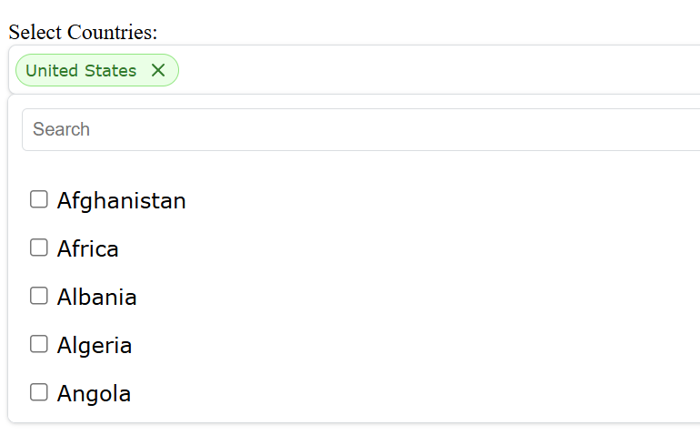
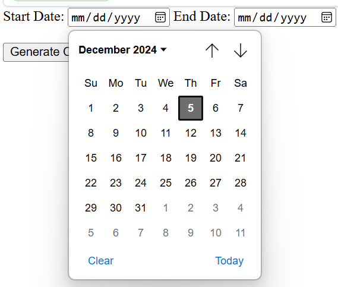
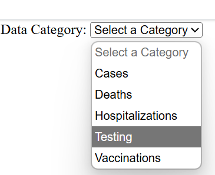
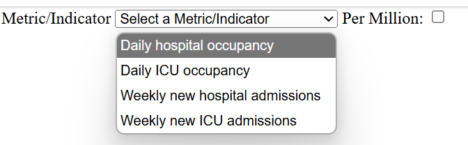

# COVID-19 Visualization App

## Installation and Setup

### Prerequisites
- Python 3.13: Download from [python.org](https://www.python.org/downloads/)
- PostgreSQL: Download from [postgresql.org](https://www.postgresql.org/download/)
- Ensure both are added to your Path

### Setup Instructions
1. **Clone the repository**
    - Open a new terminal in your desired directory and run:
   ```bash
   git clone "https://github.com/evanjaram/CSE412-Project.git"
   cd CSE412-Project
   ```
2. **Set Up Database Locally**
    - Navigate to the Database directory and run:
    ```bash
    psql -U postgres -f setup_db.sql
    ```
    - NOTE: you will be prompted to enter the postgres administrator password you created when setting up PostgreSQL.
3. **Verify Database Set Up**
    - Run the below command:
    ```bash
    psql -U covid_user -d covid_database
    ```
    - When prompted for the password, enter:
    ```bash
    covid_password
    ```
    - Verify db setup by running:
    ```SQL
    SELECT * FROM location LIMIT 5;
    ```
    - Output should look like this:
    
4. **Install Backend Dependencies**
    - Navigate to the Backend directory and run:
    ```bash
    pip install -r requirements.txt
    ```

## Application Startup

1. **Starting Backend**
    - Navigate to the Backend directory and run:
    ```bash
    python app.py
    ```
    **<span style="color:red">!!!LEAVE THIS RUNNING UNTIL YOU ARE COMPLETELY DONE USING THE APP!!!</span>**
2. **Starting Frontend**
    - In a **NEW TERMINAL WINDOW** navigate to the Frontend directory and run:
    ```bash
    start index.html
    ```

## Application Walkthrough
1. Upon loading up the application, the user should select at least 1 country/region from the dropdown menu by clicking the arrow on the right side. The dropdown menu allows the user to also search for a country they have in mind. Selecting multiple countries/regions will compare them on the line graph.  

2. Next, select the range of dates from which you wish to view data. NOTE: end date must come after start date. The app will refuse your chart generation request if this condition is not satisfied.  

3. Select the data category you wish to visualize.  

4. Depending on your choice for the data category, you may need to select the specific metric/indicator you wish to view. (The Per Million checkbox is only available for data category Hospitalizations).  

5. Once all required input fields are filled, the user may generate the line chart by clicking the Generate Chart button.
